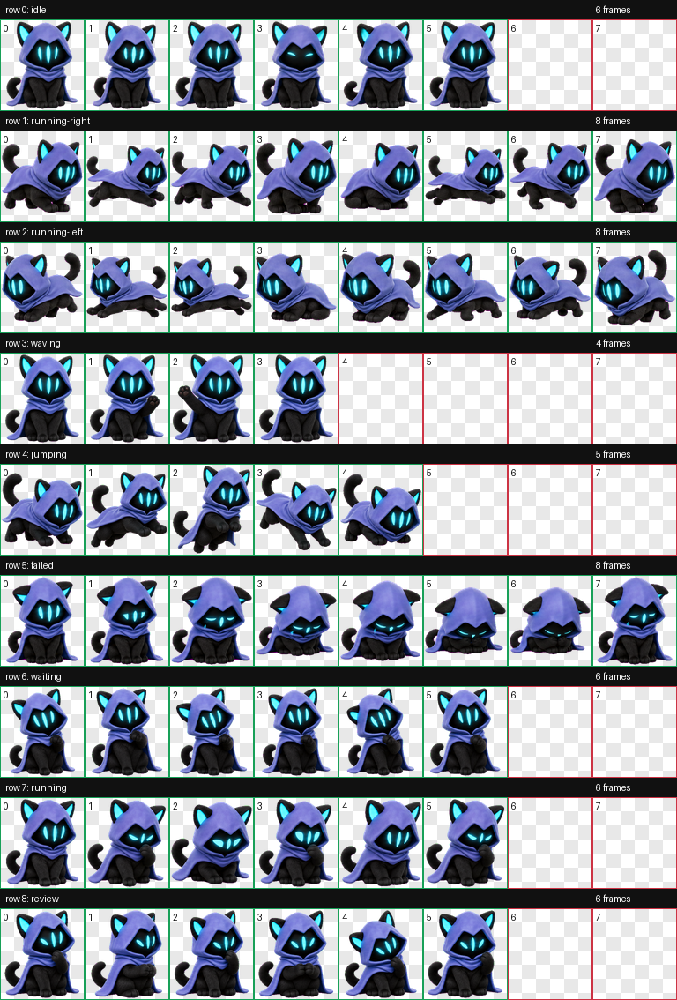

# Omen Codex Desktop Pet

给 Codex 桌面端使用的 Omen 风格自定义宠物。一只披着蓝紫色兜帽斗篷的黑猫，保留青蓝发光猫耳、黑色面罩感脸部和三道竖向青蓝眼缝，整理为 Codex 固定 8x9 精灵图格式。

[简体中文](#简体中文) · [English](#english)


> 这是粉丝制作的自定义宠物资源，不是 Riot Games、Valorant 或 Omen 的官方项目。

## 简体中文

### 预览



### 特色

- Omen 风格的萌系兜帽黑猫：蓝紫色斗篷、青蓝发光猫耳、黑色面罩脸和三道竖向发光眼缝。
- 适配 Codex 自定义宠物固定规格：`1536x1872`、8 列 x 9 行、每格 `192x208`。
- 包含 9 个 Codex 状态：`idle`、`running-right`、`running-left`、`waving`、`jumping`、`failed`、`waiting`、`running`、`review`。
- 已通过 atlas 校验：RGBA、透明背景、未使用格透明。
- 生成时避免了 Valorant 标志、UI、武器、文字和官方素材原图，只保留“兜帽黑猫 Omen”这个粉丝向视觉概念。

### 安装

把本仓库里的两个文件复制到你的 Codex 自定义宠物目录：

```text
pet.json
spritesheet.webp
```

macOS / Linux 默认路径：

```bash
mkdir -p ~/.codex/pets/omen
cp pet.json spritesheet.webp ~/.codex/pets/omen/
```

Windows 示例路径：

```text
%CODEX_HOME%\pets\omen\
├── pet.json
└── spritesheet.webp
```

如果没有设置 `CODEX_HOME`，请放到你的 Codex 配置目录下的 `pets/omen/` 文件夹中。完成后重启 Codex，或在支持热重载的版本里重新加载自定义宠物。

### 文件结构

```text
.
├── contact-sheet.png
├── LICENSE
├── pet.json
├── spritesheet.webp
├── README.md
└── .gitignore
```

### 版本说明

当前版本为初始发布版：

- `idle` 使用低干扰待机 / 眨眼动作。
- `running-right` 与 `running-left` 使用左右拖拽移动动作。
- `waving` 使用抬爪招呼动作。
- `jumping` 使用小幅跳跃动作。
- `failed` 使用低落 / 受挫表情。
- `waiting` 使用等待用户确认的期待姿态。
- `running` 使用 Codex 执行任务时的专注处理姿态，而不是字面奔跑。
- `review` 使用查看结果 / 检查输出的姿态。

### 来源与授权

- 本仓库发布的是 Codex 自定义宠物资源：`pet.json`、`spritesheet.webp` 和预览图。
- 本仓库中由作者制作和整理的文件采用 [MIT License](LICENSE) 开源。
- 角色灵感来自 Valorant 角色 Omen 的粉丝向“兜帽猫猫”形象，但本仓库没有打包 Valorant 官方截图、Logo、UI、武器或官方立绘原图。
- Valorant、Omen 及相关官方视觉设定归其权利方所有。
- MIT 协议不授予 Valorant、Omen、Riot Games 或其他第三方 IP / 商标的任何权利。
- 公开分享时建议保留本 README 中的非官方粉丝项目说明。

## English

Omen is a fan-made custom desktop pet for Codex. It is a small hooded black cat with a blue-violet cloak, cyan glowing cat ears, a dark mask-like face, and three vertical cyan eye slits, packed into the standard Codex 8x9 pet spritesheet format.

> This is an unofficial fan-made custom pet. It is not affiliated with, endorsed by, or sponsored by Riot Games, Valorant, or Omen.

### Preview


### Features

- Cute Omen-inspired hooded black cat design with cyan ears and three glowing eye slits.
- Codex custom pet atlas: `1536x1872`, 8 columns x 9 rows, `192x208` per cell.
- Includes all 9 Codex states: `idle`, `running-right`, `running-left`, `waving`, `jumping`, `failed`, `waiting`, `running`, and `review`.
- Validated as an RGBA WebP atlas with transparent unused cells.
- Avoids Valorant logos, UI, weapons, text, official screenshots, and official character art.

### Install

Copy these two files into your Codex custom pet directory:

```text
pet.json
spritesheet.webp
```

macOS / Linux default path:

```bash
mkdir -p ~/.codex/pets/omen
cp pet.json spritesheet.webp ~/.codex/pets/omen/
```

Windows example path:

```text
%CODEX_HOME%\pets\omen\
├── pet.json
└── spritesheet.webp
```

If `CODEX_HOME` is not set, place the folder under your Codex configuration directory at `pets/omen/`. Restart Codex afterward, or reload custom pets if your Codex build supports live reload.

### Repository Layout

```text
.
├── contact-sheet.png
├── LICENSE
├── pet.json
├── spritesheet.webp
├── README.md
└── .gitignore
```

### Release Notes

Initial release:

- `idle`: calm breathing and blink loop.
- `running-right` / `running-left`: directional drag movement.
- `waving`: tiny paw greeting.
- `jumping`: playful vertical hop.
- `failed`: slumped blocked / failed reaction.
- `waiting`: expectant user-approval pose.
- `running`: active task-processing pose, not literal sprinting.
- `review`: focused result-review pose.

### Credits And Rights

- This repository publishes a Codex custom pet package: `pet.json`, `spritesheet.webp`, and preview images.
- Files created and arranged by the author in this repository are released under the [MIT License](LICENSE).
- The design is inspired by the fan-made hooded-cat interpretation of Valorant's Omen, but does not include Valorant official screenshots, logos, UI, weapons, or official character artwork.
- Valorant, Omen, and related official visual designs belong to their respective rights holders.
- The MIT License does not grant any rights to Valorant, Omen, Riot Games, or any other third-party IP or trademarks.
- Please keep the unofficial fan-made project notice when sharing this pet.
